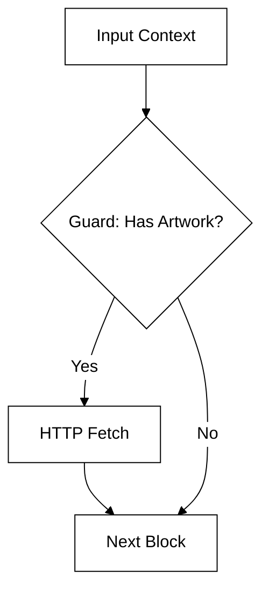
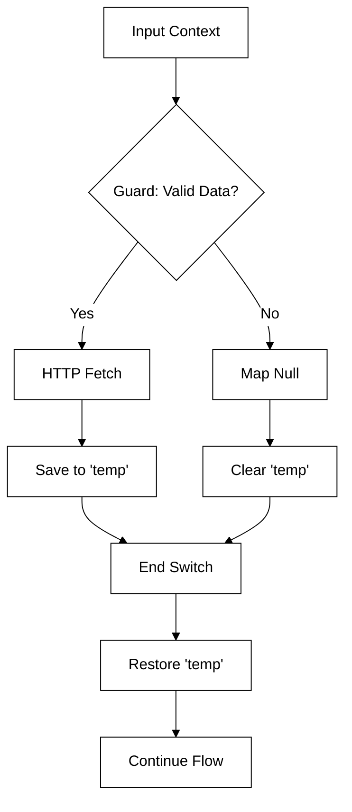
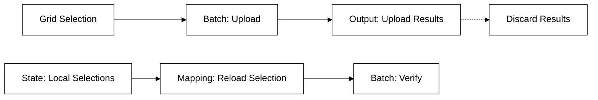

**Improving reliability in Kendraio Flows**

The Freecords Dashboard had complex batch operations that needed to be made stable. It must fetch and transform artist metadata into DDEX XML format, while uploading hundreds of rows of music and images, and avoiding buggy asynchronous behaviour. To enable robust behaviour from unreliable systems, a set of design patterns was discovered and implemented.

The core features, specifically the logic for grouping tracks into DDEX XML and the concept of a post-upload verification loop, were already present in the base system. This post isolates the architectural changes implemented on top of those existing features. The focus lies on the patterns added to make the system stable, robust, and crash-proof in a production batch environment.

### Conditional guards

**The concept**
In the original workflow, the verification loop blindly attempted to re-download every asset associated with a song to check its integrity. However, real-world data is messy: not every song has artwork, and not every release has a specific audio format. If the flow attempts to run an HTTP fetch on a `null` or empty URL, the block fails. This generates error noise or stops the flow entirely.

**The logic**
A strict "Guard" pattern is applied to the verification steps. The system asserts that the source asset, such as `context.song.artwork`, exists before allowing the HTTP block to execute.

1.  **Check:** Does the asset exist?
2.  **If yes:** Enter the block and perform the fetch.
3.  **If no:** Do nothing.

**The implementation**
The potentially failing operation is wrapped inside a `switch` block.



```json
{
  "type": "switch",
  "valueGetter": "context.song.artwork || null",
  "cases": [
    {
      "value": null,
      "blocks": []
    }
  ],
  "default": {
    "blocks": [
      {
        "type": "http",
        "method": "get",
        "blockComment": "📥 Fetch original artwork for comparison"
      }
    ]
  }
}
```

### The context bridge

**The concept**
In a flow processing hundreds of items, data stability is critical. If an API call fails or a key is missing for one item, the system needs a way to safely "step over" that item without crashing the batch. Standard HTTP blocks can be unpredictable when parameters are missing. More importantly, data from a previous successful iteration must not leak into the current failed iteration.

**The logic**
A "Context Bridge" pattern functions as a `try-catch` block for data flow.
1.  **Guard:** A `switch` block checks if the necessary keys exist.
2.  **Branch (Success):** If valid, the system performs the fetch and **saves** the result to a temporary context variable (`temp_http_response`).
3.  **Branch (Failure):** If the data is not valid, the switch avoids loading the switch block's HTTP block, and to prevent unexpected state, context variables are set to null.
4.  **Restore:** Immediately after the switch, the temporary variable is loaded back into the data stream.

**The implementation**
This pattern ensures that the flow always continues with a predictable data structure, regardless of whether the API call occurred.



```json
{
  "type": "switch",
  "valueGetter": "context.api.key != null && context.api.key != ''",
  "cases": [
    {
      "value": true,
      "blocks": [
        {
          "type": "http",
          "method": "get",
          "blockComment": "📡 Fetch data"
        },
        {
          "type": "context-save",
          "key": "temp_http_response_1",
          "blockComment": "💾 Bridge: Save successful response"
        }
      ]
    }
  ],
  "default": {
    "blocks": [
      {
        "type": "mapping",
        "mapping": "null",
        "blockComment": "⛔ Bridge: Null result"
      },
      {
        "type": "context-save",
        "key": "temp_http_response_1",
        "blockComment": "🧹 Bridge: Clear stale data"
      }
    ]
  }
}
```

### Explicit state restoration

**The concept**
In a Kendraio Flow, the output of one block becomes the input of the next. When a "Batch Upload" process runs, the data flowing out of that block is the *result* of the upload. This is typically a list of status messages.

However, the next step in the process is "Verify", which requires the *original* song data (ISRCs, UPCs), not the status messages. If the blocks are simply chained, the verification step fails because the source data was transformed into status strings.

**The logic**
The data stream coming out of the Upload batch is intentionally discarded. The user's original selection is reloaded from the state store. This "rewinds" the data context, allowing the system to run a second, independent batch process on the exact same set of items.

**The implementation**
A mapping block resets the data stream before the verification batch begins.



```json
{
  "type": "mapping",
  "mapping": "state.local.selections",
  "blockComment": "🧮 Mapping to get grid selection back AFTER uploading to try and verify"
}
```

### Developer experience: Comment navigation aid

To make these complex batch flows maintainable, a visual annotation system was introduced within the `blockComment` fields. Specific emojis are used to denote the function of the block. This allows a developer to scan the JSON definition or the UI and instantly understand the "shape" of the logic without reading the configuration of every individual block.
